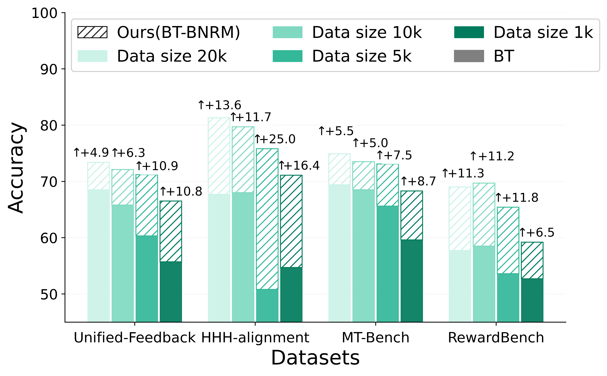
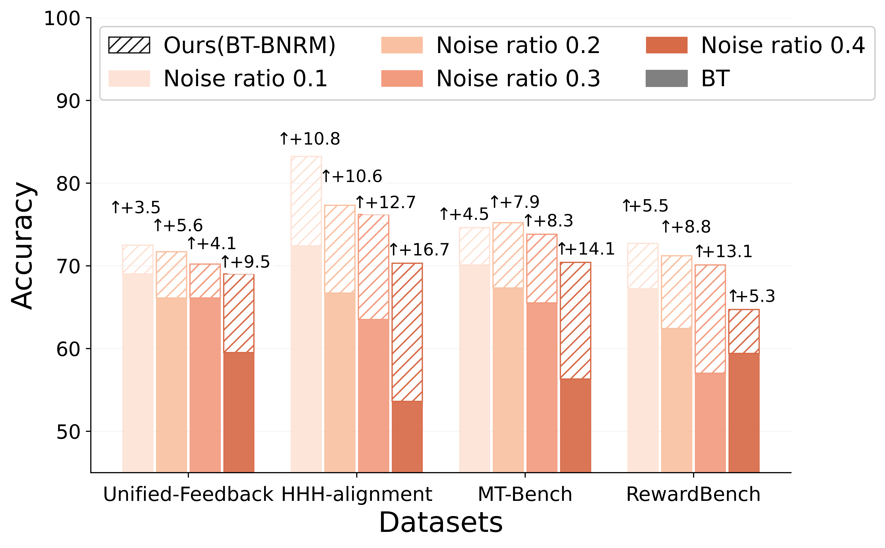

# Mitigating Reward Hacking in RLHF via Bayesian Non-negative Reward Modeling

<p align="center">
  <b>Bayesian Non-Negative Reward Model (BNRM)</b><br>
  Robust, uncertainty-aware reward modeling for RLHF.
</p>

<p align="center">
  <a href="https://huggingface.co/collections/GuoweiRong/bayesian-non-negative-reward-modeling">
    
  </a>
</p>

## ✨ Overview

Reward models learned from human preferences are central to aligning large language models (LLMs) via reinforcement learning from human feedback, yet they are often vulnerable to reward hacking due to noisy annotations and systematic biases such as response length or style.

We propose **Bayesian Non-Negative Reward Model (BNRM)**, a principled reward modeling framework that integrates non-negative factor analysis into the Bradley-Terry (BT) preference model.

BNRM represents rewards through a sparse, non-negative latent factor generative process operating at two complementary levels: instance-specific latent variables induce disentangled reward representations, while sparsity over global latent factors acts as an implicit debiasing mechanism that suppresses spurious correlations. Together, this disentanglement-then-debiasing structure enables robust uncertainty-aware reward learning.

To scale BNRM to modern LLMs, we develop an amortized variational inference network conditioned on deep model representations, allowing efficient end-to-end training. Extensive empirical results show that BNRM substantially mitigates reward over-optimization, improves robustness under distribution shifts, and yields more interpretable reward decompositions than strong baselines.

🏆 **BNRM has been accepted as an ICML 2026 Oral paper.**

## 🤗 Released Models

Our reward models will be released on Hugging Face:

- **Collection:** https://huggingface.co/collections/GuoweiRong/bayesian-non-negative-reward-modeling
- The collection will host our open-source reward models, checkpoints, and related resources for Bayesian non-negative reward modeling.

## 📈 RewardBench Results

Results are reported on [RewardBench](https://github.com/allenai/reward-bench). Best scores within each block are **bold** and second-best scores are <u>underlined</u>. Deltas show the improvement over the corresponding base reward model.

### Gemma-2B-it LoRA [Unified-Feedback](https://huggingface.co/datasets/llm-blender/Unified-Feedback)-40K

| Model | Average | Chat | Chat Hard | Safety | Reasoning |
| --- | ---: | ---: | ---: | ---: | ---: |
| BT | 64.5 | **95.8** | 37.3 | 59.9 | 64.8 |
| [BT-BNRM](https://huggingface.co/collections/GuoweiRong/bayesian-non-negative-reward-modeling) | **72.5 (+8.0)** | 95.6 (-0.2) | **43.3 (+6.0)** | <u>80.9 (+21.0)</u> | **70.1 (+5.3)** |
| [GRM-BNRM](https://huggingface.co/collections/GuoweiRong/bayesian-non-negative-reward-modeling) | <u>71.8 (+5.0)</u> | <u>95.7 (+1.6)</u> | <u>41.6 (-0.3)</u> | **81.5 (+12.0)** | <u>68.4 (+6.9)</u> |

### Gemma-2-2B-it LoRA Unified-Feedback-40K

| Model | Average | Chat | Chat Hard | Safety | Reasoning |
| --- | ---: | ---: | ---: | ---: | ---: |
| BT | 75.7 | 96.1 | 50.7 | 80.9 | 75.0 |
| [BT-BNRM](https://huggingface.co/collections/GuoweiRong/bayesian-non-negative-reward-modeling) | <u>79.7 (+4.0)</u> | <u>97.1 (+1.0)</u> | **56.3 (+5.6)** | <u>85.3 (+4.4)</u> | <u>79.9 (+4.9)</u> |
| [GRM-BNRM](https://huggingface.co/collections/GuoweiRong/bayesian-non-negative-reward-modeling) | **80.5 (+3.2)** | **97.5 (+1.1)** | <u>54.3 (+4.3)</u> | **86.2 (+1.9)** | **84.1 (+5.6)** |

### Gemma-2B-it LoRA Unified-Feedback-400K

| Model | Average | Chat | Chat Hard | Safety | Reasoning |
| --- | ---: | ---: | ---: | ---: | ---: |
| BT | 68.2 | 95.5 | 38.0 | 73.8 | 65.3 |
| [BT-BNRM](https://huggingface.co/collections/GuoweiRong/bayesian-non-negative-reward-modeling) | **73.2 (+5.0)** | **96.4 (+0.9)** | <u>41.7 (+3.7)</u> | **81.8 (+8.0)** | **72.9 (+7.6)** |
| [GRM-BNRM](https://huggingface.co/collections/GuoweiRong/bayesian-non-negative-reward-modeling) | <u>71.3 (+0.5)</u> | <u>95.7 (-2.1)</u> | **42.1 (+0.0)** | <u>80.8 (+2.9)</u> | <u>66.7 (+1.5)</u> |

### Gemma-2-2B-it LoRA Unified-Feedback-400K

| Model | Average | Chat | Chat Hard | Safety | Reasoning |
| --- | ---: | ---: | ---: | ---: | ---: |
| BT | 77.5 | 97.2 | 51.4 | 83.2 | 78.3 |
| [BT-BNRM](https://huggingface.co/collections/GuoweiRong/bayesian-non-negative-reward-modeling) | **79.5 (+2.0)** | **97.5 (+0.3)** | <u>51.7 (+0.3)</u> | <u>84.9 (+1.7)</u> | **83.8 (+5.5)** |
| [GRM-BNRM](https://huggingface.co/collections/GuoweiRong/bayesian-non-negative-reward-modeling) | <u>79.4 (+1.7)</u> | <u>97.4 (-0.5)</u> | **52.9 (+2.1)** | **85.1 (+0.5)** | <u>82.3 (+4.7)</u> |

### Advantages in Low-Resource and Noisy Settings

A robust reward model should remain reliable when preference annotations are scarce or noisy. Using Gemma-2B-it, BT-BNRM shows clear gains over BT in both low-resource training with 1K-20K Unified-Feedback samples and noisy-label training with 40K samples. The improvements become especially pronounced in the most challenging regimes, showing that BNRM is both data-efficient and noise-tolerant for realistic preference-learning scenarios.

| Few-shot Results | Noise Robustness |
| --- | --- |
|  |  |

## 🛠️ Installation

Create the environment:

```bash
conda create -n bnrm python==3.10 -y
conda activate bnrm
```

Install dependencies:

```bash
pip install -r requirements.txt
```

`bench.txt` and `swift.txt` record the environments we used for reward-model evaluation and PPO training. They are provided as reference dependency snapshots.

## 🚀 Training Reward Models

All scripts are under `scripts/`. Adjust dataset paths, model paths, GPU ids, and output directories before running.

Train a BT reward model:

```bash
bash scripts/train_bt_rm_lora.sh
```

Train a full fine-tuned BT reward model:

```bash
bash scripts/train_bt_rm_full.sh
```

Train a GRM reward model:

```bash
bash scripts/train_grm_lora.sh
```

Train a full fine-tuned GRM reward model:

```bash
bash scripts/train_grm_full.sh
```

Train BT-BNRM and GRM-BNRM:

```bash
bash scripts/train_method_lora.sh
```

Train full BT-BNRM:

```bash
bash scripts/train_method_full.sh
```

## 📊 Evaluating Reward Models

For benchmark evaluation, this repository expects external benchmark code from:

- **RewardBench:** https://github.com/allenai/reward-bench
- **RM-Bench:** https://github.com/THU-KEG/RM-Bench

We thank the authors of RewardBench and RM-Bench for their valuable evaluation frameworks.

Evaluate BT and GRM reward models:

```bash
bash scripts/eval_bt_rm.sh
bash scripts/eval_grm_rm.sh
```

Evaluate BNRM reward models:

```bash
bash scripts/eval_method_rm_lora.sh
bash scripts/eval_method_rm_full.sh
```

Run RewardBench-style evaluation:

```bash
bash scripts/rewardbench/BT_RewardBench.sh
bash scripts/rewardbench/GRM_RewardBench.sh
bash scripts/rewardbench/BNBT_RewardBench.sh
bash scripts/rewardbench/BNBT_RewardBenchfull.sh
```

Run RM-Bench-style evaluation:

```bash
bash scripts/RMbench/BT.sh
bash scripts/RMbench/GRM_RMbench.sh
bash scripts/RMbench/BNRM.sh
```

## 🧪 RLHF / PPO

We include PPO scripts for using BNRM as a reward model in RLHF.

Our PPO training scripts are built around **[ms-swift](https://github.com/modelscope/ms-swift)** and our PPO result evaluation uses **[EvalScope](https://github.com/modelscope/evalscope)**:

Run PPO training:

```bash
bash scripts/rlhf/BNRM_swift_ppo/ms_ppo_script.sh
```

Run PPO evaluation:

```bash
bash scripts/rlhf/BNRM_swift_ppo/evalscope_evaluation_script.sh
```

## 🎯 Best-of-N

We also provide Best-of-N (BoN) scripts for analyzing how proxy reward models select responses from multiple sampled candidates. See `rlhf/bon/README.md` for the full workflow.

Train proxy reward models:

> **Tip:** If the reward models have already been trained, this step can be skipped.

```bash
bash scripts/rlhf/bon/step1_train_proxy_reward_model_baseline.sh
bash scripts/rlhf/bon/step1_train_proxy_reward_model_grm.sh
```

Generate candidate responses and score them:

```bash
bash scripts/rlhf/bon/step2_generate_samples_vllm.sh
bash scripts/rlhf/bon/step3_obtain_proxy_score.sh
```

Select Best-of-N responses and evaluate them with the gold reward model:

```bash
bash scripts/rlhf/bon/step4_choose_best_of_n.sh
bash scripts/rlhf/bon/step5_obtain_bon_gold_score.sh
bash scripts/rlhf/bon/step6_collect.sh
```

## 📁 Repository Structure

```text
reward_models/       Reward model training code
rm_eval/             Reward model evaluation code
scripts/             Training, evaluation, RewardBench, RM-Bench, and RLHF scripts
rlhf/                RLHF, PPO, BoN, and data-generation utilities
requirements.txt     Main dependency file
bench.txt            Reward-model evaluation environment reference
swift.txt            PPO/Swift environment reference
```

## 🙏 Acknowledgements

This codebase is built on top of the excellent **[Generalizable Reward Model](https://github.com/YangRui2015/Generalizable-Reward-Model)**.

This project also builds on the open-source LLM alignment ecosystem, including Hugging Face Transformers, PEFT, Accelerate, TRL/Swift, ms-swift, EvalScope, RewardBench, and RM-Bench. We sincerely thank the maintainers and authors of these projects.

## 📚 Citation

If you find this work useful, please cite:

```bibtex
@misc{duan2026mitigatingrewardhackingrlhf,
      title={Mitigating Reward Hacking in RLHF via Bayesian Non-negative Reward Modeling}, 
      author={Zhibin Duan and Guowei Rong and Zhuo Li and Bo Chen and Mingyuan Zhou and Dandan Guo},
      year={2026},
      eprint={2602.10623},
      archivePrefix={arXiv},
      primaryClass={cs.LG},
      url={https://arxiv.org/abs/2602.10623}, 
}
```
